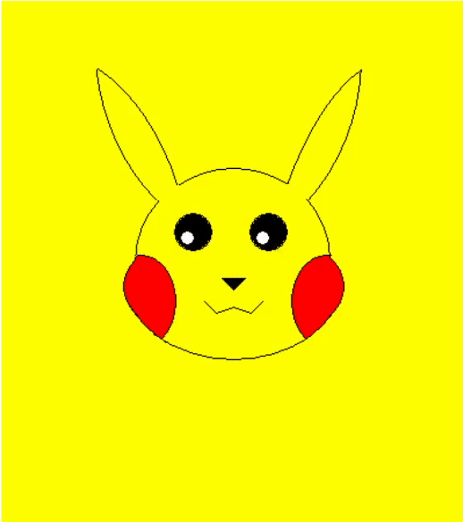

<h1 align="center">
  

  

   
  Pikachu - Turing
   
</h1>

  •
  <a href="#overview1">Overview</a>
  •
  <a href="#GIF">GIF</a>
  •

# Overview

- I created Pikachu in grade 10 as a fun little project with simple lines, arcs, and other irregular shapes. This was also the first time I used animations.

# GIF
<h1 align="center">
  

</h1>